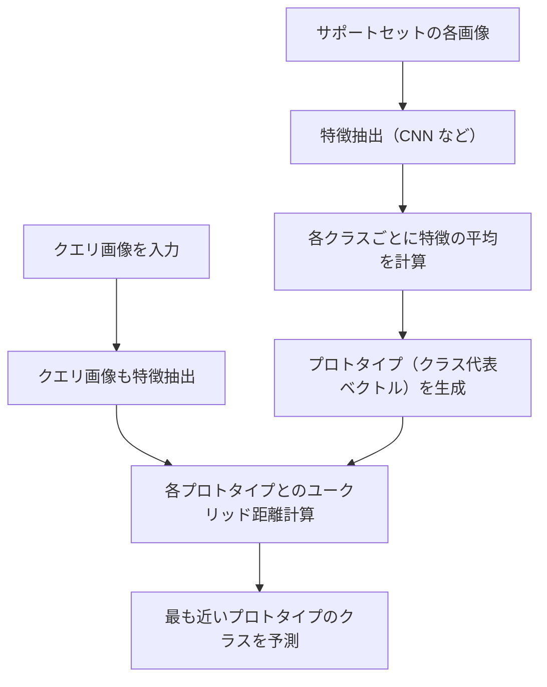
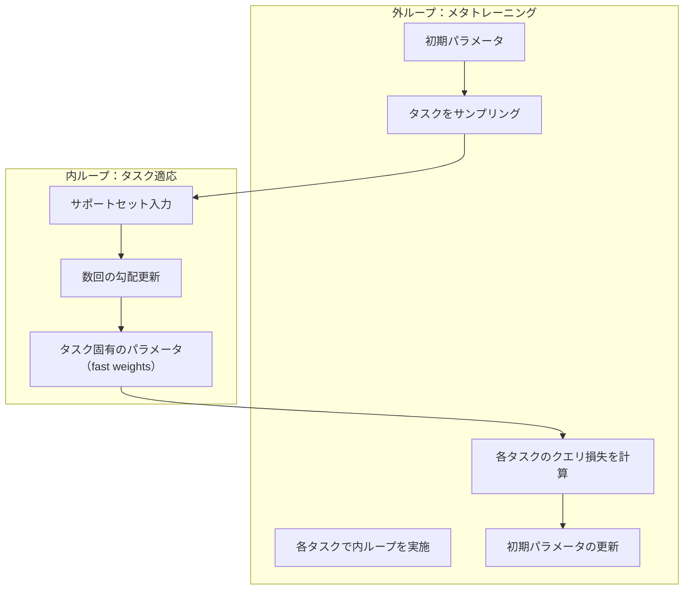
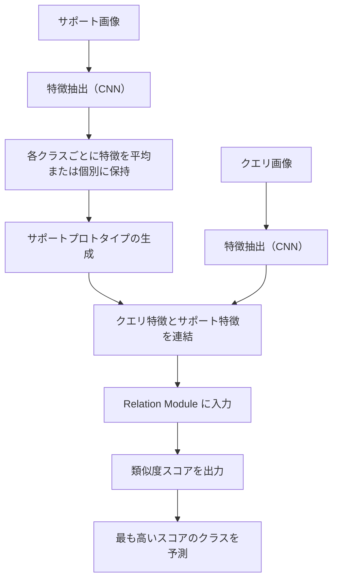
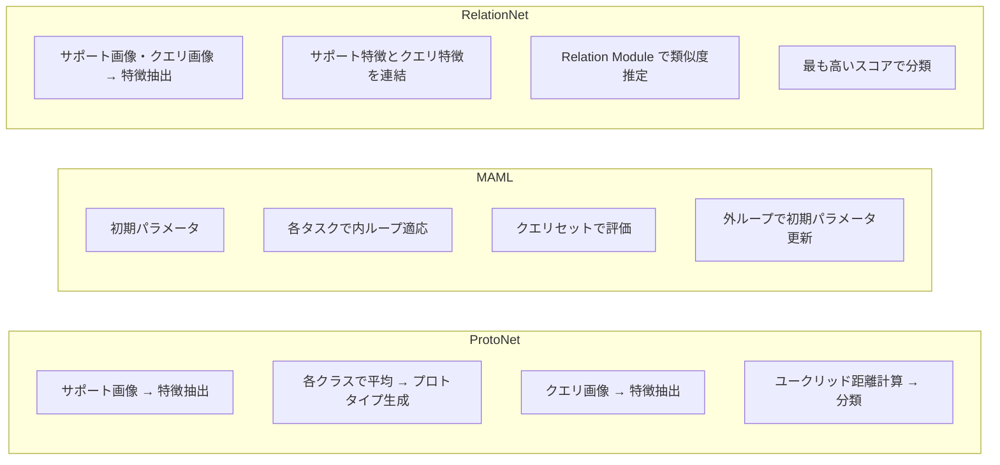

# Few-Shot Learning 手法の技術解説と実装ガイド

本技術解説では、**Few-Shot Learning** の代表的手法である **Prototypical Networks (ProtoNet)**、**Model-Agnostic Meta-Learning (MAML)**、**Relation Network** の概要と特徴、使用シーン、およびサンプル実装例を詳しく解説します。実装例は **Python 3** と **PyTorch** を用いており、独自のデータセットを準備して動作検証が可能です。

## 目次

- [Few-Shot Learning 手法の技術解説と実装ガイド](#few-shot-learning-手法の技術解説と実装ガイド)
  - [目次](#目次)
  - [1. Few-Shot Learning とは](#1-few-shot-learning-とは)
  - [2. 3手法の概要・比較](#2-3手法の概要比較)
    - [2.1 Prototypical Networks (ProtoNet)](#21-prototypical-networks-protonet)
      - [概要](#概要)
      - [動作の流れ](#動作の流れ)
      - [Mermaid による図解](#mermaid-による図解)
      - [特徴と有効なケース](#特徴と有効なケース)
    - [2.2 Model-Agnostic Meta-Learning (MAML)](#22-model-agnostic-meta-learning-maml)
      - [概要](#概要-1)
      - [動作の流れ](#動作の流れ-1)
      - [Mermaid による図解](#mermaid-による図解-1)
      - [特徴と有効なケース](#特徴と有効なケース-1)
    - [2.3 Relation Network](#23-relation-network)
      - [概要](#概要-2)
      - [動作の流れ](#動作の流れ-2)
      - [Mermaid による図解](#mermaid-による図解-2)
      - [特徴と有効なケース](#特徴と有効なケース-2)
    - [2.4 各手法の比較まとめ](#24-各手法の比較まとめ)
  - [3. データセットの用意方法](#3-データセットの用意方法)
  - [4. 実装例のサンプルコード](#4-実装例のサンプルコード)
    - [4.1 共通パート：カスタムデータセットとタスク生成](#41-共通パートカスタムデータセットとタスク生成)
    - [4.2 Prototypical Networks の例](#42-prototypical-networks-の例)
      - [4.2.1 埋め込みネットワーク](#421-埋め込みネットワーク)
      - [4.2.2 オフラインモード（プロトタイプの事前計算と推論）](#422-オフラインモードプロトタイプの事前計算と推論)
      - [4.2.3 オンライン適用モード](#423-オンライン適用モード)
    - [4.3 Model-Agnostic Meta-Learning (MAML) の例](#43-model-agnostic-meta-learning-maml-の例)
      - [4.3.1 ヘルパー関数：model\_forward\_with\_weights](#431-ヘルパー関数model_forward_with_weights)
      - [4.3.2 オフライン適用モード](#432-オフライン適用モード)
      - [4.3.3 オンライン適用モード](#433-オンライン適用モード)
    - [4.4 Relation Network の例](#44-relation-network-の例)
      - [4.4.1 Embedding Network と Relation Module](#441-embedding-network-と-relation-module)
      - [4.4.2 オフライン適用モード](#442-オフライン適用モード)
      - [4.4.3 オンライン適用モード](#443-オンライン適用モード)
  - [5. まとめ](#5-まとめ)

---

## 1. Few-Shot Learning とは

**Few-Shot Learning** とは、少数のラベル付きデータ（例：1クラスあたり 1 枚～数枚程度）から新しいクラスを認識・推論できるように学習する手法群の総称です。  
通常のディープラーニングは、各クラスに大量のラベル付きデータが必要になりますが、少数データしか用意できない場合に **Few-Shot Learning** が有効です。

Few-Shot Learning では、**N-way K-shot** という形式でタスクを定義することが一般的です。  

- **N-way**: クラス数  
- **K-shot**: 各クラスの学習用データ枚数（サポートセット）

学習時には「メタトレーニング」と呼ばれる工程を行い、異なるクラス・タスクを何度もシミュレーションして（episode あるいは task と呼ぶ）モデルに汎用的な学習をさせます。その上で、新たに登場したクラスに対して **K** 枚のサンプルのみで分類が可能なようにする、という流れです。

---

## 2. 3手法の概要・比較

本章では、Few-Shot Learning の代表的な 3 つの手法について、単なる概要に留まらず、各手法がどのような考え方に基づいているのか、実際にどのような流れで動作するのかを分かりやすく説明します。また、Mermaid を使った図解を用いることで、全体の流れや各手法の特徴を直感的に理解できるようにします。

---

### 2.1 Prototypical Networks (ProtoNet)

#### 概要

Prototypical Networks では、各クラスの「サポートセット」にある画像から **特徴ベクトル（埋め込み）** を抽出し、同じクラスに属する画像の特徴を平均して **プロトタイプ（代表ベクトル）** を作成します。  
新たな画像（クエリ画像）の特徴と各クラスのプロトタイプとの **ユークリッド距離**（またはその他の距離）を計算し、最も近いプロトタイプに属するクラスと判断します。

#### 動作の流れ

1. **サポートセットの処理**  
   - 各クラスごとに画像を用意する（例：5クラス、各1枚の場合 → 5枚）。
   - 画像を CNN などで特徴ベクトルに変換。
   - 同一クラスの特徴を平均して、そのクラスの「プロトタイプ」を作成。

2. **クエリ画像の分類**  
   - クエリ画像も同様に特徴ベクトルに変換。
   - 各クラスのプロトタイプとのユークリッド距離を計算。
   - 距離が最も小さいクラスに分類。

#### Mermaid による図解



#### 特徴と有効なケース

- **シンプルで計算負荷が低い：** 学習・推論ともに高速。
- **直感的：** 「各クラスの中心」を求めるので、クラス内のばらつきが大きくない場合に効果的。
- **使用例：** 比較的明確な特徴を持つ画像分類タスク、エピソードベースの学習の導入実験など。

---

### 2.2 Model-Agnostic Meta-Learning (MAML)

#### 概要

MAML は「新しいタスクに対して、**少数回の勾配更新** で素早く適応できる初期パラメータ」を学習する手法です。  
「内ループ」でサポートセットに対して数回の勾配更新を行い、タスク固有のパラメータ（fast adaptation）を得た上で、クエリセットでの誤差をもとに「外ループ」で初期パラメータ自体を改善します。

#### 動作の流れ

1. **初期パラメータの学習（メタ学習）**  
   - 複数のタスク（エピソード）で共通の初期パラメータを更新。

2. **タスクごとの適応（内ループ）**  
   - 各タスクのサポートセットで数回の勾配更新を実施し、タスクに合わせたパラメータ（fast weights）を作成。

3. **タスク評価と外ループ更新**  
   - 生成された fast weights でクエリセットに対する損失を計算し、初期パラメータに関する勾配を逆伝搬。

#### Mermaid による図解



#### 特徴と有効なケース

- **汎用性が高い：** 画像分類のみならず、回帰や強化学習など多様なタスクに適用可能。
- **初期パラメータの学習：** 新しいタスクへの適応が数ステップで可能となるため、タスク間の変化が大きい場合に有効。
- **計算コスト：** 内ループと外ループの二重構造のため、計算量が多くなりやすい。

---

### 2.3 Relation Network

#### 概要

Relation Network は、サポートセットとクエリ画像間の **類似度（relation）** をニューラルネットワークで学習する手法です。  
固定の距離（ユークリッド距離）を使うのではなく、学習可能な **Relation Module** を用いて、サポート画像の特徴とクエリ画像の特徴を組み合わせたときの「関係性スコア」を出力します。

#### 動作の流れ

1. **特徴抽出**  
   - サポートセットとクエリ画像を、それぞれ CNN などで特徴ベクトルまたは特徴マップに変換する。

2. **サポートプロトタイプの生成**  
   - 各クラスごとに、サポートセットの特徴の平均をとる（または複数のサポート画像と個別に組み合わせる場合もある）。

3. **Relation Module による類似度推定**  
   - クエリ画像の特徴と各クラスのサポート特徴を **連結（concat）** し、Relation Module で類似度スコア（0～1）を出力。
   - このスコアにより、最も関連性の高いクラスを予測する。

#### Mermaid による図解



#### 特徴と有効なケース

- **学習可能な類似度関数：** 固定のユークリッド距離では捉えにくい、複雑な特徴間の関係性を学習可能。
- **柔軟性：** 色調や背景など、画像の見かけが大きく異なる場合でも、関係性を捉えることができる。
- **計算リソース：** 学習パラメータが増え、計算量も多くなりがちなため、データセットの規模やタスクの複雑さに合わせた調整が必要。

---

### 2.4 各手法の比較まとめ

以下の表は、3 つの手法の特徴を簡単に比較したものです。

| 手法                    | 主な考え方                                      | 特徴                                            | 適用例                                               |
|-------------------------|-------------------------------------------------|-------------------------------------------------|------------------------------------------------------|
| **Prototypical Networks** | クラスごとに「中心（プロトタイプ）」を計算し、距離で分類  | シンプル・計算負荷が低い                         | クラス内ばらつきが小さい画像分類、エピソード学習の導入実験  |
| **MAML**                | 初期パラメータを学習し、少数の勾配更新で各タスクに適応     | タスク間の適応性が高く、汎用的                      | タスク間の違いが大きい場合、回帰や強化学習への応用           |
| **Relation Network**    | 学習可能な Relation Module で類似度を算出                | 固定距離では捉えにくい関係性も学習可能、柔軟性あり      | 背景や条件が大きく異なる画像認識、複雑な関係性が存在する場合   |

また、以下の Mermaid 図は、3 つの手法の処理の違いを直感的に理解するための概略フローです。



---

## 3. データセットの用意方法

多くの Few-Shot Learning の実装では、クラスごとにサブフォルダを用意し、その中に各クラスの画像を配置するディレクトリ構造を採用します。たとえば、以下のような構造です。

```txt
custom_dataset/
  classA/
    img001.jpg
    img002.jpg
    ...
  classB/
    img001.jpg
    ...
  classC/
    ...
  ...
```

この構造のもと、以下の **CustomImageDataset** クラスでは、  

- ルートディレクトリ配下のサブフォルダ名をクラス名とし、  
- 各クラス内の画像ファイル（拡張子が `.jpg`, `.jpeg`, `.png` など）を読み込み、  
- 画像パスと対応するクラスインデックスのタプルを内部リスト `samples` として保持します。

また、N-way K-shot タスク作成用の関数 **make_few_shot_task** は、  

- 任意の N 個のクラスをランダムに選択し、  
- 各クラスから K 枚をサポートセット、さらに Q 枚をクエリセットとしてサンプリングする実装例です。  
（例：5-way 1-shot + 5 query → 各クラス最低6枚の画像が必要）

以下に最適化したコード例を示します。

```python
import os
import random
from PIL import Image
import torch
from torch.utils.data import Dataset
import torchvision.transforms as T

# --- カスタムデータセットクラス ---
class CustomImageDataset(Dataset):
    def __init__(self, root_dir, transform=None):
        """
        Args:
            root_dir (str): 画像データセットのルートディレクトリ（例："custom_dataset/"）
            transform (callable, optional): 画像に適用する前処理。指定がない場合は ToTensor() を使用。
        """
        self.root_dir = root_dir
        self.transform = transform if transform else T.ToTensor()
        
        # サブフォルダ名をクラス名として取得（ソートして一定順序に）
        self.classes = sorted([d for d in os.listdir(root_dir)
                               if os.path.isdir(os.path.join(root_dir, d))])
        self.samples = []
        for idx, cls_name in enumerate(self.classes):
            cls_folder = os.path.join(root_dir, cls_name)
            for fname in os.listdir(cls_folder):
                if fname.lower().endswith(('.jpg', '.jpeg', '.png')):
                    img_path = os.path.join(cls_folder, fname)
                    self.samples.append((img_path, idx))

    def __len__(self):
        return len(self.samples)

    def __getitem__(self, idx):
        img_path, label = self.samples[idx]
        image = Image.open(img_path).convert('RGB')
        if self.transform:
            image = self.transform(image)
        return image, label

# --- N-way K-shot タスク作成関数 ---
def make_few_shot_task(dataset, N=5, K=1, Q=5):
    """
    dataset から N-way K-shot タスクを作成します。
    
    各クラスから K 枚をサポートセット、さらに Q 枚をクエリセットとしてランダムサンプリングします。
    
    Returns:
        (support_paths, support_labels), (query_paths, query_labels)
        ※ ここでは画像パスを返します。実際の読み込みは後で transform を適用して行います。
    """
    # dataset.classes に格納された全クラスから N クラスを選択
    selected_classes = random.sample(dataset.classes, N)
    # 選択クラスを 0～N-1 のラベルに変換する辞書
    class_to_new_label = {cls_name: i for i, cls_name in enumerate(selected_classes)}
    
    # 選択クラスの画像パスをまとめる
    class_to_images = {cls_name: [] for cls_name in selected_classes}
    for img_path, label_idx in dataset.samples:
        cls_name = dataset.classes[label_idx]
        if cls_name in selected_classes:
            class_to_images[cls_name].append(img_path)
    
    support_images, support_labels = [], []
    query_images, query_labels = [], []
    for cls_name in selected_classes:
        all_imgs = class_to_images[cls_name]
        # (K + Q) 枚以上の画像があることを前提
        selected_imgs = random.sample(all_imgs, K + Q)
        # 前半 K 枚 → サポート、残り Q 枚 → クエリ
        new_label = class_to_new_label[cls_name]
        support_images.extend(selected_imgs[:K])
        support_labels.extend([new_label] * K)
        query_images.extend(selected_imgs[K:K+Q])
        query_labels.extend([new_label] * Q)
    
    return (support_images, support_labels), (query_images, query_labels)
```

---

## 4. 実装例のサンプルコード

以下では、**Few-Shot Learning** の代表的手法のサンプル実装例として、  

- **Prototypical Networks**  
- **Model-Agnostic Meta-Learning (MAML)**  
- **Relation Network**  

の各手法における、**オフライン（事前学習済み・固定モデルとして推論）** と **オンライン適用（新タスク到来時に即時適応）** の利用例を紹介します。  
  
### 4.1 共通パート：カスタムデータセットとタスク生成

前節で定義した `CustomImageDataset` と `make_few_shot_task` をそのまま利用します。

### 4.2 Prototypical Networks の例

#### 4.2.1 埋め込みネットワーク

ResNet18 の最終全結合層を除去して 512 次元の特徴ベクトルを得る例です。

```python
import torch.nn as nn
from torchvision.models import resnet18

class EmbeddingNet(nn.Module):
    def __init__(self):
        super().__init__()
        base_model = resnet18(pretrained=True)
        # 最終の全結合層(fc)を除去して特徴抽出器として利用
        self.features = nn.Sequential(*list(base_model.children())[:-1])

    def forward(self, x):
        x = self.features(x)  # [B, 512, 1, 1]（ResNet18 の場合）
        x = x.view(x.size(0), -1)  # [B, 512]
        return x
```

#### 4.2.2 オフラインモード（プロトタイプの事前計算と推論）

サポートセットから各クラスのプロトタイプ（各クラスの埋め込みの平均）を算出し、保存・推論に利用します。

```python
import torch.optim as optim

def compute_and_save_prototypes(model, support_imgs, support_labels, save_path="prototypes.pt"):
    """
    Args:
        support_imgs (Tensor): [num_samples, C, H, W]
        support_labels (Tensor): [num_samples]（ラベルは 0～N-1）
    """
    model.eval()
    with torch.no_grad():
        embeddings = model(support_imgs)  # [num_samples, embed_dim]
    N = support_labels.max().item() + 1
    embed_dim = embeddings.size(1)
    prototypes = torch.zeros(N, embed_dim).to(embeddings.device)
    for c in range(N):
        prototypes[c] = embeddings[support_labels == c].mean(dim=0)
    torch.save(prototypes, save_path)
    print(f"Prototypes saved to {save_path}")
    return prototypes

def offline_protonet_inference(model, prototypes, image, transform):
    """
    Args:
        image (PIL.Image): 入力画像
        prototypes (Tensor): [N, embed_dim]
    """
    model.eval()
    with torch.no_grad():
        input_tensor = transform(image).unsqueeze(0).cuda()
        embedding = model(input_tensor)  # [1, embed_dim]
        distances = torch.cdist(embedding, prototypes)  # [1, N]
        pred = distances.argmin(dim=1).item()
    return pred

# 使用例（ファイル実行時）
if __name__ == "__main__":
    from PIL import Image
    transform = T.Compose([T.Resize((224, 224)), T.ToTensor()])
    model = EmbeddingNet().cuda()
    
    # CustomImageDataset を用いてサポートセットを作成（例：5-way 5-shot）
    dataset = CustomImageDataset(root_dir="custom_dataset", transform=None)
    (support_paths, support_labels), _ = make_few_shot_task(dataset, N=5, K=5, Q=0)
    support_imgs = torch.stack([transform(Image.open(p).convert('RGB')) for p in support_paths]).cuda()
    support_labels_t = torch.tensor(support_labels).long().cuda()
    
    prototypes = compute_and_save_prototypes(model, support_imgs, support_labels_t, save_path="prototypes.pt")
    
    # 推論例：test.jpg を分類
    image = Image.open("test.jpg").convert("RGB")
    pred = offline_protonet_inference(model, prototypes, image, transform)
    print(f"[Offline ProtoNet] Predicted class: {pred}")
```

#### 4.2.3 オンライン適用モード

システムが常時稼働している環境では、新たなサポートセットが到着するたびにプロトタイプを再計算し、その後の画像入力に対して推論を実施できます。

```python
def online_protonet_system(model, transform):
    current_prototypes = None
    while True:
        if new_support_set_available():
            support_imgs, support_labels = get_new_support_set()
            support_imgs = support_imgs.cuda()
            support_labels = support_labels.cuda()
            model.eval()
            with torch.no_grad():
                embeddings = model(support_imgs)
            N = support_labels.max().item() + 1
            embed_dim = embeddings.size(1)
            prototypes = torch.zeros(N, embed_dim).to(embeddings.device)
            for c in range(N):
                prototypes[c] = embeddings[support_labels == c].mean(dim=0)
            current_prototypes = prototypes
            print("Updated prototypes for new task (ProtoNet).")
        
        image = receive_input_image()  # PIL.Image
        if current_prototypes is None:
            print("No support set available; skipping image.")
            continue
        pred = offline_protonet_inference(model, current_prototypes, image, transform)
        output_prediction(pred)

# ダミー関数例（実際の環境に合わせ実装してください）
def new_support_set_available():
    import random
    return random.random() < 0.1  # 10% の確率で新たなサポートセット到来

def get_new_support_set():
    # 例として、CustomImageDataset を使い 5-way 5-shot のサポートセットを生成
    dataset = CustomImageDataset(
        root_dir="custom_dataset",
        transform=T.Compose([T.Resize((224, 224)), T.ToTensor()])
    )
    (support_paths, support_labels), _ = make_few_shot_task(dataset, N=5, K=5, Q=0)
    support_imgs = torch.stack([T.ToTensor()(Image.open(p).convert('RGB')) for p in support_paths])
    support_labels_t = torch.tensor(support_labels).long()
    return support_imgs, support_labels_t

def receive_input_image():
    return Image.open("test.jpg").convert("RGB")

def output_prediction(pred):
    print(f"[Online ProtoNet] Predicted class: {pred}")

# online_protonet_system(model, transform)  # 実際の運用時に有効化
```

---

### 4.3 Model-Agnostic Meta-Learning (MAML) の例

MAML では、内ループでサポートセットを用いて数ステップの勾配更新（fast adaptation）を行い、外ループ（または推論時）にクエリ画像で評価します。

#### 4.3.1 ヘルパー関数：model_forward_with_weights

一時的なパラメータ（fast weights）を使って forward するための関数です。

```python
def model_forward_with_weights(model, x, weights_dict):
    """
    model のパラメータの一部を weights_dict に置き換えて forward を実行し、元の状態に戻します。
    """
    # 現在のパラメータを退避
    original_params = {}
    for name, param in model.named_parameters():
        original_params[name] = param.data.clone()
        param.data = weights_dict[name].data

    outputs = model(x)

    # 元に戻す
    for name, param in model.named_parameters():
        param.data = original_params[name]
    return outputs
```

#### 4.3.2 オフライン適用モード

サポートセットに対して内ループで適応（fast weights の生成）し、その fast weights を用いて推論する例です。

```python
import torch.nn.functional as F

def maml_adapt_offline(model, support_imgs, support_labels, loss_fn, inner_lr=0.01, inner_steps=5):
    """
    サポートセットを用いて inner_steps 回の適応を行い、fast weights を生成して返します。
    """
    fast_weights = {name: param.clone() for name, param in model.named_parameters()}
    for _ in range(inner_steps):
        outputs = model_forward_with_weights(model, support_imgs, fast_weights)
        loss = loss_fn(outputs, support_labels)
        grads = torch.autograd.grad(loss, fast_weights.values(), create_graph=False)
        fast_weights = {name: param - inner_lr * grad 
                        for ((name, param), grad) in zip(fast_weights.items(), grads)}
    return fast_weights

def offline_maml_inference(model, fast_weights, image, transform):
    """
    fast weights を用いた推論例
    """
    model.eval()
    with torch.no_grad():
        input_tensor = transform(image).unsqueeze(0).cuda()
        outputs = model_forward_with_weights(model, input_tensor, fast_weights)
        pred = outputs.argmax(dim=1).item()
    return pred

# 使用例（ファイル実行時）
if __name__ == "__main__":
    from PIL import Image
    transform = T.Compose([T.Resize((224, 224)), T.ToTensor()])
    # MAML 用シンプル CNN や ResNet18 ベースモデルを利用（例として MAMLResNet18）
    import torchvision.models as models
    class MAMLResNet18(nn.Module):
        def __init__(self, num_classes=5):
            super().__init__()
            base_model = models.resnet18(pretrained=True)
            in_features = base_model.fc.in_features
            base_model.fc = nn.Linear(in_features, num_classes)
            self.model = base_model
        def forward(self, x):
            return self.model(x)
    
    model = MAMLResNet18(num_classes=5).cuda()
    loss_fn = nn.CrossEntropyLoss()

    # サポートセットの生成（例：5-way 5-shot）
    dataset = CustomImageDataset(
        root_dir="custom_dataset",
        transform=T.Compose([T.Resize((224, 224)), T.ToTensor()])
    )
    (support_paths, support_labels), _ = make_few_shot_task(dataset, N=5, K=5, Q=0)
    support_imgs = torch.stack([transform(Image.open(p).convert('RGB')) for p in support_paths]).cuda()
    support_labels_t = torch.tensor(support_labels).long().cuda()

    fast_weights = maml_adapt_offline(model, support_imgs, support_labels_t, loss_fn,
                                      inner_lr=0.01, inner_steps=5)
    torch.save(fast_weights, "maml_fast_weights.pt")
    print("Adapted MAML parameters saved.")

    image = Image.open("test.jpg").convert("RGB")
    pred = offline_maml_inference(model, fast_weights, image, transform)
    print(f"[Offline MAML] Predicted class: {pred}")
```

#### 4.3.3 オンライン適用モード

新たなサポートセット到来時に即時適応（fast weights 更新）を行い、その fast weights で推論する例です。

```python
def online_maml_system(model, loss_fn, transform, inner_lr=0.01, inner_steps=5):
    current_fast_weights = None
    while True:
        if new_support_set_available():
            support_imgs, support_labels = get_new_support_set()  # すでに Tensor 化済み
            support_imgs = support_imgs.cuda()
            support_labels = support_labels.cuda()
            current_fast_weights = maml_adapt_offline(model, support_imgs, support_labels,
                                                      loss_fn, inner_lr, inner_steps)
            print("Online: Updated MAML fast weights for new task.")
        
        image = receive_input_image()
        if current_fast_weights is None:
            print("No support set available; skipping image.")
            continue
        pred = offline_maml_inference(model, current_fast_weights, image, transform)
        output_prediction(pred)

# online_maml_system(model, loss_fn, transform, inner_lr=0.01, inner_steps=5)
```

---

### 4.4 Relation Network の例

Relation Network では、まずサポートセットおよびクエリ画像を埋め込み、  
各クエリと各クラス（もしくはそのプロトタイプ）のペアごとに類似度スコアを Relation Module により出力し、  
そのスコアで分類を行います。

#### 4.4.1 Embedding Network と Relation Module

```python
class EmbeddingNetRN(nn.Module):
    def __init__(self):
        super().__init__()
        self.conv = nn.Sequential(
            nn.Conv2d(3, 64, kernel_size=3, padding=1),
            nn.ReLU(),
            nn.MaxPool2d(2),
            nn.Conv2d(64, 64, kernel_size=3, padding=1),
            nn.ReLU(),
            nn.MaxPool2d(2),
        )
    def forward(self, x):
        return self.conv(x)  # 出力サイズ：[B, 64, H', W']

class RelationModule(nn.Module):
    def __init__(self, in_channels=128, hidden_dim=64):
        super().__init__()
        self.network = nn.Sequential(
            nn.Conv2d(in_channels, hidden_dim, kernel_size=3, padding=1),
            nn.ReLU(),
            nn.MaxPool2d(2),
            nn.Conv2d(hidden_dim, hidden_dim, kernel_size=3, padding=1),
            nn.ReLU(),
            nn.AdaptiveAvgPool2d(1),
        )
        self.fc = nn.Linear(hidden_dim, 1)

    def forward(self, x):
        out = self.network(x)  # [B, hidden_dim, 1, 1]
        out = out.view(out.size(0), -1)
        out = self.fc(out)
        return torch.sigmoid(out)  # 類似度スコア（0～1）
```

#### 4.4.2 オフライン適用モード

サポートセットから各クラスのプロトタイプ（埋め込みの平均）を計算し、  
クエリ画像とのペアごとに Relation Module のスコアを算出して最も高いスコアのクラスを推論します。

```python
def compute_offline_relation_prototypes(embedding_net, support_imgs, support_labels):
    embedding_net.eval()
    with torch.no_grad():
        support_features = embedding_net(support_imgs)  # [num_samples, 64, h, w]
    N = support_labels.max().item() + 1
    prototypes = []
    for c in range(N):
        class_feats = support_features[support_labels == c]
        prototypes.append(class_feats.mean(dim=0, keepdim=True))
    prototypes = torch.cat(prototypes, dim=0)  # [N, 64, h, w]
    return prototypes

def offline_relation_inference(embedding_net, relation_net, prototypes, image, transform):
    embedding_net.eval()
    relation_net.eval()
    with torch.no_grad():
        input_tensor = transform(image).unsqueeze(0).cuda()  # [1, C, H, W]
        query_feature = embedding_net(input_tensor)  # [1, 64, h, w]
        N = prototypes.size(0)
        query_expand = query_feature.expand(N, -1, -1, -1)
        # チャネル方向に連結してペアを作成
        relation_pairs = torch.cat([query_expand, prototypes], dim=1)  # [N, 128, h, w]
        scores = relation_net(relation_pairs)  # [N, 1]
        scores = scores.view(-1)
        pred = scores.argmax().item()
    return pred

# 使用例（ファイル実行時）
if __name__ == "__main__":
    transform = T.Compose([T.Resize((128, 128)), T.ToTensor()])
    embedding_net = EmbeddingNetRN().cuda()
    relation_net = RelationModule(in_channels=128, hidden_dim=64).cuda()
    
    dataset = CustomImageDataset(
        root_dir="custom_dataset",
        transform=T.Compose([T.Resize((128, 128)), T.ToTensor()])
    )
    (support_paths, support_labels), _ = make_few_shot_task(dataset, N=5, K=5, Q=0)
    support_imgs = torch.stack([T.ToTensor()(Image.open(p).convert('RGB')) for p in support_paths]).cuda()
    support_labels_t = torch.tensor(support_labels).long().cuda()
    
    prototypes = compute_offline_relation_prototypes(embedding_net, support_imgs, support_labels_t)
    
    image = Image.open("test.jpg").convert("RGB")
    pred = offline_relation_inference(embedding_net, relation_net, prototypes, image, transform)
    print(f"[Offline RelationNet] Predicted class: {pred}")
```

#### 4.4.3 オンライン適用モード

サポートセットが更新された場合に、プロトタイプを再計算し、以降の入力画像に対して推論を行います。

```python
def online_relation_network_system(embedding_net, relation_net, transform):
    current_prototypes = None
    while True:
        if new_support_set_available():
            support_imgs, support_labels = get_new_support_set()
            support_imgs = support_imgs.cuda()
            support_labels = support_labels.cuda()
            current_prototypes = compute_offline_relation_prototypes(embedding_net, support_imgs, support_labels)
            print("Online: Updated prototypes for new task (RelationNet).")
        
        image = receive_input_image()
        if current_prototypes is None:
            print("No support set available; skipping image.")
            continue
        pred = offline_relation_inference(embedding_net, relation_net, current_prototypes, image, transform)
        output_prediction(pred)

# online_relation_network_system(embedding_net, relation_net, transform)
```

---

## 5. まとめ

- **Prototypical Networks**  
  - 各クラスの「中心」を求め、その距離を基にクエリ画像を分類します。  
  - シンプルで実装もしやすく、計算負荷も低いため、入門として適しています。

- **MAML**  
  - 複数タスクに対応できるように、少数回の更新でタスク適応が可能な初期パラメータを学習します。  
  - 内外ループの二重構造により、タスク間の変化に柔軟に対応できる反面、計算リソースが必要です。

- **Relation Network**  
  - サポート画像とクエリ画像間の類似度を、学習可能なネットワークで推定します。  
  - 固定の距離尺度では捉えにくい複雑な関係性を学習できるため、見た目や条件が多様なデータに向いています。

以上のように、各手法にはそれぞれの強みと適用シーンが存在します。タスクの性質や利用可能な計算資源、求められる柔軟性などに応じて、最適なアプローチを選択してください。
