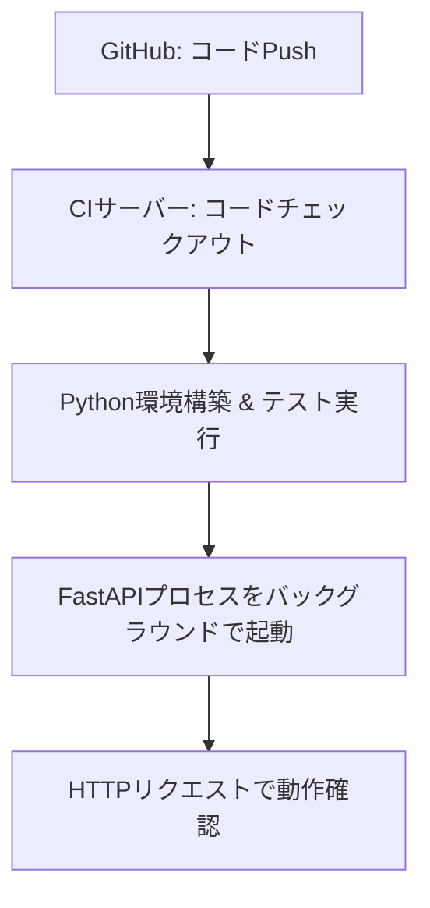
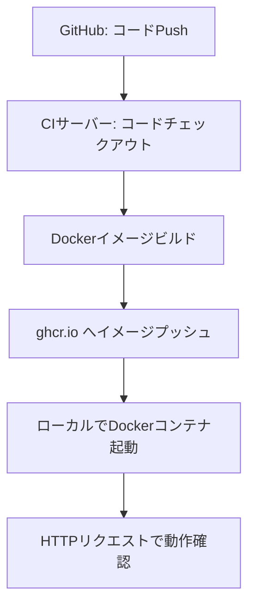
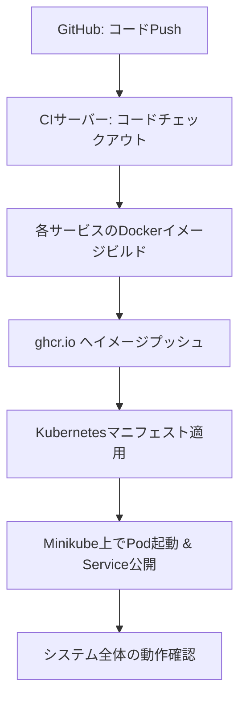

# CI/CD パイプラインによるローカルデプロイ手順（FastAPI プロジェクト編）

## 0. 前提条件と概要

### 0.1 必要な環境・ツール

- **GitHub リポジトリ:** FastAPI のコードが含まれるリポジトリ（例：`fastapi-project`）。
- **GitHub Actions:** CI/CD ワークフローの実行基盤として利用。
- **Self-hosted GitHub Runner:**  
  - **概要:** GitHub が管理する Runner ではなく、あなた自身のマシン（ローカル環境）に Runner をインストールします。  
  - **導入手順:**  
    1. GitHub リポジトリの「Settings」→「Actions」→「Runners」にアクセスし、「New self-hosted runner」を選択。  
    2. 対応する OS 用の Runner をダウンロード、解凍。  
    3. ターミナルで `./config.sh`（または Windows なら `config.cmd`）を実行し、GitHub から発行されるトークンや URL を入力して Runner を登録。  
    4. 最後に `./run.sh` を実行して Runner を起動。  
- **Minikube (または kind):** ローカル Kubernetes クラスタの構築用（後述の Kubernetes 編で利用）。
- **Docker:** コンテナイメージのビルド・実行用。

### 0.2 GitHub Container Registry (ghcr.io) の概要と設定

- **ghcr.io とは？**  
  GitHub Container Registry は GitHub が提供するコンテナイメージのホスティングサービスです。  
  - **メリット:** イメージの一元管理、バージョン管理、キャッシュ利用、アクセス制御が可能。  
  - **プライベート設定:** リポジトリやパッケージの可視性をパブリックまたはプライベートに設定できます。
  
- **PAT の発行と利用:**  
  1. GitHub の「Settings」→「Developer settings」→「Personal access tokens」で新しいトークンを生成。  
  2. スコープとして `write:packages`、`read:packages`、必要なら `delete:packages`（および `repo` など）を設定。  
  3. 生成したトークンは GitHub Actions の Secrets（例：`GHCR_PAT`）に登録し、ワークフロー内で利用します。

---

## 1. コンテナ無しでプロセスとして起動する場合

### 1.1 目的と概要

- **目的:**  
  コンテナを使わず、Python の仮想環境上で FastAPI アプリケーションを直接起動し、CI/CD の基本フロー（コード取得、テスト、実行、確認）を学習する。
  
- **対象:**  
  コンテナ技術に入る前の初学者向け。シンプルな実行環境の構築に適しています。

### 1.2 プロジェクト構成例

```
fastapi-project/
├── app/
│   └── main.py         # FastAPI のエントリーポイント
├── tests/
│   └── test_main.py    # 単体テスト用コード
├── requirements.txt    # 必要なパッケージ一覧
└── .github/
    └── workflows/
        └── deploy.yml  # GitHub Actions のワークフロー定義
```

### 1.3 コード例

#### app/main.py
```python
from fastapi import FastAPI

app = FastAPI()

@app.get("/")
async def read_root():
    return {"Hello": "World"}

if __name__ == "__main__":
    import uvicorn
    uvicorn.run(app, host="0.0.0.0", port=8000)
```

#### .github/workflows/deploy.yml（コンテナ無しの場合）
```yaml
name: CI/CD Deploy (Process)
# ワークフロー名。プロセスとしてアプリを起動するフローです。

on:
  push:
    branches: [ main ]
# main ブランチに push されたときに実行される。

jobs:
  deploy:
    runs-on: self-hosted
    # 自己ホスト型 Runner（ローカルマシン上に構築済み）で実行。

    steps:
      - name: Checkout code
        uses: actions/checkout@v3
        # GitHub から最新のコードを取得。

      - name: Set up Python environment
        run: |
          python -m venv venv
          source venv/bin/activate
          pip install -r requirements.txt
        # 仮想環境を作成し、依存パッケージをインストール。

      - name: Run tests
        run: |
          source venv/bin/activate
          pytest --maxfail=1 --disable-warnings -q
        # pytest による単体テストの実行。

      - name: Start FastAPI application
        run: |
          source venv/bin/activate
          nohup uvicorn app.main:app --host 0.0.0.0 --port 8000 &
          # FastAPI アプリをバックグラウンドで起動。nohup によりログは nohup.out に出力される。
          sleep 5
          curl http://localhost:8000
          # アプリ起動確認のため、curl でエンドポイントにアクセス。
```

#### 1.4 概要図（Mermaid）


---

## 2. コンテナありで起動する場合

### 2.1 目的と概要

- **目的:**  
  Docker を利用して FastAPI アプリをコンテナ化し、環境依存性を解消。  
- **背景:**  
  Docker イメージをビルドし、GitHub Container Registry (ghcr.io) にプッシュすることで、イメージのバージョン管理や再利用性が向上します。  
- **ghcr.io の利用理由:**  
  - 一元管理およびキャッシュ利用が可能。  
  - プライベート設定によりアクセス制御も可能。  
  - CI/CD パイプラインで自動ビルド＆プッシュのフローを整備することで、環境更新が効率的に行えます。

### 2.2 プロジェクト構成例

```
fastapi-project/
├── app/
│   └── main.py
├── requirements.txt
├── Dockerfile
└── .github/
    └── workflows/
        └── deploy.yml
```

### 2.3 コード例

#### Dockerfile
```dockerfile
FROM python:3.9-slim

WORKDIR /app
COPY requirements.txt .
RUN pip install --no-cache-dir -r requirements.txt
COPY ./app /app

CMD ["uvicorn", "main:app", "--host", "0.0.0.0", "--port", "80"]
```

#### .github/workflows/deploy.yml（コンテナありの場合）
```yaml
name: CI/CD Deploy (Container)
# ワークフロー名。Docker イメージのビルドとプッシュ、コンテナの起動を行うフローです。

on:
  push:
    branches: [ main ]
# main ブランチへの push で起動。

jobs:
  build-deploy:
    runs-on: self-hosted
    # 自己ホスト型 Runner 上で実行。

    env:
      REGISTRY: ghcr.io
      IMAGE_NAME: ${{ env.REGISTRY }}/yourusername/fastapi-project
      # ghcr.io 上でのイメージ名の定義（yourusername を実際のユーザー名に置き換え）。

    steps:
      - name: Checkout code
        uses: actions/checkout@v3
        # コードチェックアウト。

      - name: Set up Docker Buildx
        uses: docker/setup-buildx-action@v2
        # Docker Buildx のセットアップ（マルチプラットフォームやキャッシュ利用が可能）。

      - name: Log in to GitHub Container Registry
        uses: docker/login-action@v2
        with:
          registry: ${{ env.REGISTRY }}
          username: ${{ github.actor }}
          password: ${{ secrets.GHCR_PAT }}
        # PAT（GHCR_PAT）を使用して ghcr.io にログイン。Secrets に登録済みの PAT を利用。

      - name: Build and push Docker image
        uses: docker/build-push-action@v4
        with:
          context: .
          push: true
          tags: ${{ env.IMAGE_NAME }}:latest
        # Dockerfile に基づきイメージをビルドし、ghcr.io にプッシュ。

      - name: Run Docker container locally
        run: |
          docker rm -f fastapi-container || true
          # 以前のコンテナがあれば削除。
          docker run -d --name fastapi-container -p 8000:80 ${{ env.IMAGE_NAME }}:latest
          # プッシュ済みイメージからコンテナを起動。ホストのポート8000とコンテナ内ポート80をマッピング。
          sleep 5
          curl http://localhost:8000
          # 起動確認のため、HTTP リクエストを送信。
```

#### 2.4 概要図（Mermaid）


---

## 3. Kubernetes（複数コンテナ構成）でのデプロイ

### 3.1 目的と概要

- **目的:**  
  複数のコンテナ（例: FastAPI アプリ、データベース、キャッシュ）を連携させ、Kubernetes クラスタ（Minikube や kind）上でマイクロサービスとして運用する。  
- **背景:**  
  Kubernetes による運用を通じて、スケーリング、ローリングアップデート、自己修復などの運用手法を学習。  
- **注意:**  
  Kubernetes は実行時に Docker から containerd や CRI-O などに移行しているため、**イメージビルドは従来通り Dockerfile で行われます**が、実行環境は別のランタイムとなります。

### 3.2 プロジェクト構成例

```
fastapi-project/
├── app/
│   └── main.py
├── requirements.txt
├── Dockerfile
├── k8s/
│   ├── deployment.yaml
│   └── service.yaml
└── .github/
    └── workflows/
        └── deploy.yml
```

### 3.3 Kubernetes マニフェスト例と解説

#### k8s/deployment.yaml
```yaml
apiVersion: apps/v1              # 使用する API バージョン（Deployment の標準）
kind: Deployment                 # リソースタイプを Deployment と指定
metadata:
  name: fastapi-deployment       # Deployment の名称
spec:
  replicas: 2                    # 起動する Pod 数（冗長性のため）
  selector:
    matchLabels:
      app: fastapi              # 管理対象の Pod を識別するラベル（template と一致させる）
  template:
    metadata:
      labels:
        app: fastapi            # Pod に付与するラベル（Service で利用）
    spec:
      containers:
      - name: fastapi           # コンテナの名前
        image: ghcr.io/yourusername/fastapi-project:latest
        # 使用するイメージ。ghcr.io にプッシュ済みの最新イメージを参照
        ports:
        - containerPort: 80     # コンテナ内でアプリがリッスンするポート
```

#### k8s/service.yaml
```yaml
apiVersion: v1                   # Service の標準 API バージョン
kind: Service                    # リソースタイプを Service と指定
metadata:
  name: fastapi-service          # Service の名称
spec:
  selector:
    app: fastapi                # 対象の Pod を選択するラベル（Deployment と同じ）
  ports:
    - protocol: TCP             # プロトコル指定（通常は TCP）
      port: 8000                # クライアントがアクセスする Service のポート
      targetPort: 80            # Pod 内のコンテナがリッスンするポート
  type: NodePort                # NodePort によりローカル外部アクセスを可能に
```

### 3.4 GitHub Actions ワークフロー例（Kubernetes 編）

```yaml
name: CI/CD Deploy (Kubernetes)
# ワークフロー名。Kubernetes を使ったデプロイフローです。

on:
  push:
    branches: [ main ]
# main ブランチに push されたときに実行される。

jobs:
  build-deploy:
    runs-on: self-hosted
    # 自己ホスト型 Runner（Minikube または kind へのアクセスが可能な環境）で実行。

    env:
      REGISTRY: ghcr.io
      IMAGE_NAME: ${{ env.REGISTRY }}/yourusername/fastapi-project
      KUBECONFIG: /home/runner/.kube/config
      # kubectl がアクセスするための kubeconfig ファイルのパス（事前にセットアップ済み）
    
    steps:
      - name: Checkout code
        uses: actions/checkout@v3
        # 最新コードを取得

      - name: Set up Docker Buildx
        uses: docker/setup-buildx-action@v2
        # Docker Buildx をセットアップ

      - name: Log in to GitHub Container Registry
        uses: docker/login-action@v2
        with:
          registry: ${{ env.REGISTRY }}
          username: ${{ github.actor }}
          password: ${{ secrets.GHCR_PAT }}
        # ghcr.io にログイン

      - name: Build and push Docker image for FastAPI
        uses: docker/build-push-action@v4
        with:
          context: .
          push: true
          tags: ${{ env.IMAGE_NAME }}:latest
        # Docker イメージをビルドして ghcr.io にプッシュ

      - name: Deploy to Kubernetes (Minikube)
        run: |
          kubectl apply -f k8s/deployment.yaml
          kubectl apply -f k8s/service.yaml
          kubectl rollout status deployment/fastapi-deployment
          # Kubernetes マニフェストを適用してクラスタへデプロイし、状態を確認
```

### 3.5 概要図（Mermaid）


---

## 4. まとめ

### GitHub Runner の取得と導入
- **Self-hosted Runner の利用:**  
  GitHub の「Settings > Actions > Runners」から Runner をダウンロードし、登録・起動することで、ローカル環境における CI/CD ジョブの実行が可能となります。

### ghcr.io の利用と設定
- **目的:**  
  コンテナイメージを一元管理、バージョン管理、アクセス制御を行うため。  
- **設定手順:**  
  1. GitHub リポジトリでパッケージ機能が有効か確認。  
  2. 必要なスコープ（write/read:packages など）を付与した PAT を生成し、GitHub Secrets に登録。  
  3. ワークフロー内で `docker/login-action` を利用し、PAT を使って ghcr.io にログイン。  
- **メリット:**  
  複数環境で同じイメージを利用できるため、CI/CD フローの一貫性と効率が向上します。

### 各段階のデプロイ方法
- **コンテナ無し:**  
  Python 仮想環境を構築し、直接プロセスとして FastAPI を起動。テスト実行や curl による動作確認が可能。
- **コンテナあり:**  
  Dockerfile を利用してコンテナイメージをビルドし、ghcr.io にプッシュ。ローカルで Docker コンテナとして実行する流れ。
- **Kubernetes（複数コンテナ）:**  
  複数のサービスを Kubernetes マニフェストで管理し、Minikube（または kind）上で複数 Pod を起動・連携させる。  
  ※ Kubernetes は実行ランタイムとして Docker から containerd 等へ移行しているが、イメージビルドは従来通り Dockerfile を利用します。