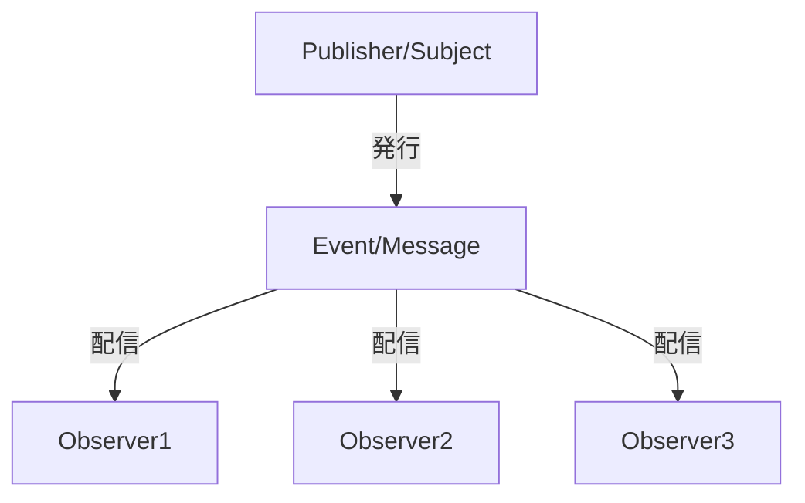
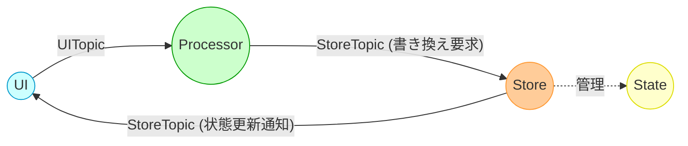

# ObserverパターンとPyPubSubによるグローバル状態管理

## 1. Observerパターンとは？

Observerパターンは、「発行者（Subject／Publisher）」と「購読者（Observer／Listener）」の関係を定義するデザインパターンです。  
発行者は状態の変更やイベントを発行し、購読者はそのイベントを受け取り対応する処理を実行します。  
このパターンの主なメリットは、各コンポーネント間の依存関係を低減（疎結合）し、システムの保守性や拡張性を向上させる点にあります。

以下は、Observerパターンの基本的な概念をMermaidで図解したものです。



上記図では、Publisherがイベント（メッセージ）を発行すると、そのイベントが複数のObserver（購読者）に配信され、各Observerはそれぞれ独立した処理を実行します。

### なぜObserverパターンが良いのか？

- **疎結合な設計**  
  各コンポーネントは、直接お互いを参照せずに、トピック（イベント名）に基づいてメッセージを送受信するため、変更の影響範囲が限定され、保守性が向上します。

- **拡張性**  
  新たな機能やモジュールを追加する際に、既存のコンポーネントを変更せずに新しいObserverを登録するだけで機能拡張が可能です。

- **テストの容易さ**  
  コンポーネントが独立しているため、単体テストやモックを利用したテストがしやすく、バグの早期発見に役立ちます。

- **再利用性**  
  発行側と購読側が分離しているため、異なるプロジェクトやモジュール間で共通のイベント処理ロジックを再利用できます。

---

## 2. PyPubSubの紹介（基本的な使い方）

PyPubSubは、Observerパターンをシンプルに実現するためのPythonライブラリです。  
これにより、アプリケーション内の各モジュールが直接依存することなく、トピックを介してメッセージの発行と購読を行えます。

### 基本的な使い方

1. **インストールとインポート**

   ```bash
   pip install PyPubSub
   ```

   ```python
   from pubsub import pub
   ```

2. **リスナー（購読側）の定義と登録**

   ```python
   def listener_example(arg1, arg2=None):
       print("listener_example received:")
       print("  arg1 =", arg1)
       print("  arg2 =", arg2)

   # "rootTopic" に対してリスナーを登録
   pub.subscribe(listener_example, "rootTopic")
   ```

3. **メッセージの送信**

   ```python
   pub.sendMessage("rootTopic", arg1=123, arg2={"a": 456, "b": "abc"})
   ```

   このコードを実行すると、`listener_example` が呼び出され、引数が出力されます。

---

## 3. なぜObserverパターン／PyPubSubが良いのか

何も考えずに各コンポーネント間を直接参照してしまうと、モジュール間の依存性が強くなり、変更に弱い設計になってしまいます。  
一方、Observerパターンを利用すると、発行者と購読者が互いに独立して動作できるため、以下のメリットがあります。

- **保守性の向上**  
  各モジュールは、トピックに対するメッセージ送受信だけを意識すればよいため、機能変更があっても他の部分に影響を与えにくい。

- **拡張が容易**  
  新しい機能を追加する際、既存のコードを大きく変更する必要がなく、必要な部分にObserverを追加するだけで済みます。

- **再利用性の向上**  
  モジュール間の通信が抽象化されるため、同じ仕組みを別プロジェクトで再利用しやすい。

---

## 4. グローバル状態管理の実装例

### 4.1 UI・Store・Processor・State の関係

グローバルに扱いたいデータ（状態）を Store が一元管理し、**UI は Store に直接触らず**、**ユーザー操作（アクション）は Processor が受け取り、必要に応じて Store を更新し、更新結果を Store から UI に通知**する、というフローが考えられます。  
以下の Mermaid 図のように、UI と Store の間を Processor が仲介し、最終的に状態が更新されると Store が UI に更新結果を送ります。



- **UI**  
  - ボタンクリックなどの操作でイベントを発行（`UITopic`）  
  - Store の状態は直接参照せず、Store からの通知（`StoreTopic`）を購読して表示を更新

- **Processor**  
  - UI から発行されたトピック（`UITopic`）を購読し、必要なロジックや外部処理を行ったうえで、Store に対し「状態をこう書き換えてください」というトピックを発行（`StoreTopic` で「書き換え要求」を送る設計の場合もあれば、別のアクションTopicを使う場合もあり）  
  - ここで複数の UI 情報を集約したり、DB に問い合わせるなどの副作用を含む処理を行う

- **Store**  
  - Processor からの「状態変更要求」を受け取り、内部の `State` を更新  
  - 更新後、「状態が変わった」ことを UI に通知するトピック（`StoreTopic` など）を発行  
  - グローバルな状態 (`State`) を一貫して管理

---

### 4.2 コードスニペット

#### 4.2.1 基底クラスの紹介コードスニペット

Tkinter での画面レイアウトやイベント登録をシンプルにするために、以下のような **BaseRoot**, **BasePage**, **BaseComponent** を定義します。  
（※ すでに他の箇所で定義済みの場合はそちらを参照してください）

```python
import abc
import tkinter as tk
from tkinter import ttk
from pubsub import pub
from ttkthemes import ThemedTk

class BaseComponent(ttk.Frame, metaclass=abc.ABCMeta):
    """再利用可能なコンポーネントの基底クラス"""
    def __init__(self, master=None, **kwargs):
        super().__init__(master, **kwargs)
        self.initialize()
        self.register_pubsub()

    @abc.abstractmethod
    def initialize(self):
        """コンポーネント固有のUI初期化処理"""
        pass

    @abc.abstractmethod
    def register_pubsub(self):
        """コンポーネント固有の購読処理"""
        pass

    @abc.abstractmethod
    def destroy_component(self):
        """破棄処理"""
        pass


class BasePage(ttk.Frame, metaclass=abc.ABCMeta):
    """画面全体の基底クラス"""
    def __init__(self, master=None, **kwargs):
        super().__init__(master, **kwargs)
        self.initialize()
        self.register_pubsub()

    @abc.abstractmethod
    def initialize(self):
        pass

    @abc.abstractmethod
    def register_pubsub(self):
        pass

    @abc.abstractmethod
    def destroy_page(self):
        pass


class BaseRoot(ThemedTk, metaclass=abc.ABCMeta):
    """アプリケーションのルートウィンドウ基底クラス"""
    def __init__(self, **kwargs):
        super().__init__(**kwargs)
        self.set_theme("arc")  # テーマ設定
        self.initialize()
        self.register_pubsub()

    @abc.abstractmethod
    def initialize(self):
        pass

    @abc.abstractmethod
    def register_pubsub(self):
        pass

    @abc.abstractmethod
    def destroy_root(self):
        pass
```

---

#### 4.2.2 Topic／State／Store のクラス紹介コードスニペット

##### (1) Topic クラス

ここでは、「誰が発行するか」を軸にした命名で `UITopic`, `ProcessorTopic`, `StoreTopic` を用意します。  
**Python 3.11 以降の `StrEnum`** を使って、定義ミスを減らしつつ IDE の補完も活用できます。

```python
from enum import StrEnum

class UITopic(StrEnum):
    """UI が発行するトピック"""
    BUTTON_CLICK = "ui.button_click"
    # 他にもユーザー操作系を追加

class ProcessorTopic(StrEnum):
    """Processor が発行するトピック"""
    REQUEST_COUNTER_INCREMENT = "processor.request_counter_increment"
    # 他にも外部問い合わせ完了などを通知するトピックを追加

class StoreTopic(StrEnum):
    """Store が発行するトピック"""
    COUNTER_UPDATED = "store.counter_updated"
    # 他にも state が更新された際の通知を追加
```

##### (2) State クラス

アプリケーションが扱うグローバルな状態を定義します。  
ここでは `dataclasses.dataclass` を用いて、読みやすく簡潔にしています。

```python
from dataclasses import dataclass

@dataclass
class AppState:
    """アプリがグローバルに保持する状態を定義"""
    counter: int = 0
    user_name: str = ""
```

##### (3) Store クラス (Singleton)

**Store** はアプリケーション全体の状態を一元管理するシングルトンです。  
Processor からのトピックを購読して state を更新し、更新後に `StoreTopic` で通知を発行します。

```python
from pubsub import pub

class Store:
    _instance = None

    def __new__(cls):
        if cls._instance is None:
            cls._instance = super().__new__(cls)
            cls._instance.state = AppState()
        return cls._instance

    def __init__(self):
        if not hasattr(self, "_initialized"):
            self._initialized = True
            # Processor が要求を発行したら購読し、state を更新
            pub.subscribe(self.on_request_counter_increment,
                          ProcessorTopic.REQUEST_COUNTER_INCREMENT.value)

    def on_request_counter_increment(self):
        """Processor がカウンター増加をリクエストしてきたときの処理"""
        self.state.counter += 1
        # 更新後、UI へ通知
        pub.sendMessage(StoreTopic.COUNTER_UPDATED.value, new_value=self.state.counter)
```

---

#### 4.2.3 利用例のコードスニペット（やや複雑なアプリ）

以下は、上記で紹介した基底クラスや Topic／State／Store を使って、**UI → Processor → Store → UI** のフローを実現する簡易アプリケーション例です。  
やや複雑にするため、`Processor` 側で複数の操作を行ったり、もうひとつ別のボタンを用意するなど、適宜拡張できます。

```python
import tkinter as tk
from tkinter import ttk
from pubsub import pub

# 上記で示した基底クラス
# from base_classes import BaseRoot, BasePage, BaseComponent

# Topicクラス, Stateクラス, Storeクラスをインポート (例)
# from store_and_topics import UITopic, ProcessorTopic, StoreTopic, Store

# ========== 1. Processor ==========

class MyProcessor:
    """
    UI のアクション (UITopic) を購読し、
    必要に応じて ProcessorTopic を発行。
    """
    def __init__(self):
        pub.subscribe(self.on_button_click, UITopic.BUTTON_CLICK.value)

    def on_button_click(self):
        """
        UI から BUTTON_CLICK を受け取ったら、
        Store にカウンター増やすよう依頼 (ProcessorTopic.REQUEST_COUNTER_INCREMENT)
        """
        # ここで、もし外部APIアクセスや複数UI情報の集約が必要なら行う
        pub.sendMessage(ProcessorTopic.REQUEST_COUNTER_INCREMENT.value)


# ========== 2. UI コンポーネント ==========

class IncrementButtonComponent(BaseComponent):
    """
    ボタンコンポーネント:
    クリック時に UITopic.BUTTON_CLICK を発行
    """
    def initialize(self):
        self.button = ttk.Button(self, text="Increment Counter", command=self.on_button_click)
        self.button.pack(pady=5, padx=10)

    def register_pubsub(self):
        # このコンポーネントは購読しない
        pass

    def destroy_component(self):
        self.button.destroy()

    def on_button_click(self):
        pub.sendMessage(UITopic.BUTTON_CLICK.value)


class CounterLabelComponent(BaseComponent):
    """
    ラベルコンポーネント:
    StoreTopic.COUNTER_UPDATED を購読して表示を更新
    """
    def initialize(self):
        self.label = ttk.Label(self, text="Counter: 0")
        self.label.pack(pady=5, padx=10)

    def register_pubsub(self):
        pub.subscribe(self.on_counter_updated, StoreTopic.COUNTER_UPDATED.value)

    def destroy_component(self):
        pub.unsubscribe(self.on_counter_updated, StoreTopic.COUNTER_UPDATED.value)
        self.label.destroy()

    def on_counter_updated(self, new_value):
        self.label.config(text=f"Counter: {new_value}")


# ========== 3. Page クラス ==========

class MainPage(BasePage):
    """
    ページ全体:
    ボタンとラベルのコンポーネントを配置
    """
    def initialize(self):
        self.button_component = IncrementButtonComponent(self)
        self.button_component.pack()

        self.label_component = CounterLabelComponent(self)
        self.label_component.pack()

    def register_pubsub(self):
        pass

    def destroy_page(self):
        self.button_component.destroy_component()
        self.label_component.destroy_component()


# ========== 4. ルートウィンドウ (アプリ) ==========

class MyApp(BaseRoot):
    def initialize(self):
        self.title("Observer & PyPubSub Demo")
        self.geometry("300x200")

        # MainPage を配置
        self.page = MainPage(self)
        self.page.pack(expand=True, fill="both")

        # Store (シングルトン) を生成
        self.store = Store()

        # Processor を生成 (UIアクション購読 → Store要求)
        self.processor = MyProcessor()

    def register_pubsub(self):
        pass

    def destroy_root(self):
        self.page.destroy_page()
        self.destroy()


# ========== 5. 起動スクリプト ==========

if __name__ == "__main__":
    app = MyApp()
    app.mainloop()
```

---

### 4.3 まとめ

- **UI** は「ユーザー操作」に基づいて `UITopic` を発行し、グローバル状態には直接触れません。  
- **Processor** は UI からのアクションを受け取り、必要であれば外部リソースを参照したり、集約したデータを元に `ProcessorTopic` で Store に要求を出します。  
- **Store** はシングルトンとしてグローバルな `AppState` を一元管理し、Processor からの要求を受けて状態を更新し、更新後に `StoreTopic` で UI に通知します。  
- UI のコンポーネントは `StoreTopic` を購読しており、カウンターやユーザー名などが更新されると、そのイベントを受け取って画面を再描画します。  

このように、**UI ↔ Processor ↔ Store** というそれぞれの責務を明確化した設計をとることで、**疎結合・拡張性の高い**アプリケーションを構築できます。