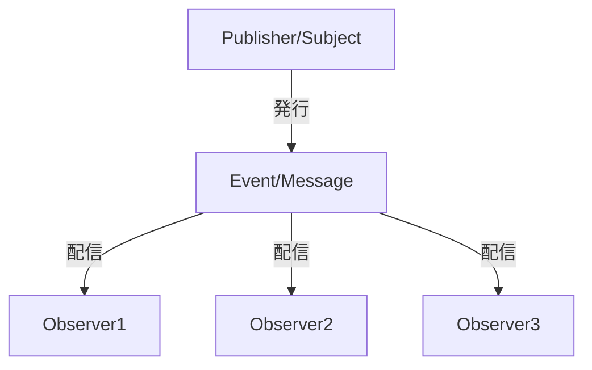

# ObserverパターンとPyPubSubによるグローバル状態管理

## 1. Observerパターンとは？

Observerパターンは、「発行者（Subject／Publisher）」と「購読者（Observer／Listener）」の関係を定義するデザインパターンです。  
発行者は状態の変更やイベントを発行し、購読者はそのイベントを受け取り対応する処理を実行します。  
このパターンの主なメリットは、各コンポーネント間の依存関係を低減（疎結合）し、システムの保守性や拡張性を向上させる点にあります。

以下は、Observerパターンの基本的な概念をMermaidで図解したものです。



上記図では、Publisherがイベント（メッセージ）を発行すると、そのイベントが複数のObserver（購読者）に配信され、各Observerはそれぞれ独立した処理を実行します。

### なぜObserverパターンが良いのか？

- **疎結合な設計**  
  各コンポーネントは、直接お互いを参照せずに、トピック（イベント名）に基づいてメッセージを送受信するため、変更の影響範囲が限定され、保守性が向上します。

- **拡張性**  
  新たな機能やモジュールを追加する際に、既存のコンポーネントを変更せずに新しいObserverを登録するだけで機能拡張が可能です。

- **テストの容易さ**  
  コンポーネントが独立しているため、単体テストやモックを利用したテストがしやすく、バグの早期発見に役立ちます。

- **再利用性**  
  発行側と購読側が分離しているため、異なるプロジェクトやモジュール間で共通のイベント処理ロジックを再利用できます。

---

## 2. PyPubSubの紹介（基本的な使い方）

PyPubSubは、Observerパターンをシンプルに実現するためのPythonライブラリです。  
これにより、アプリケーション内の各モジュールが直接依存することなく、トピックを介してメッセージの発行と購読を行えます。

### 基本的な使い方

1. **インストールとインポート**

   ```bash
   pip install PyPubSub
   ```

   ```python
   from pubsub import pub
   ```

2. **リスナー（購読側）の定義と登録**

   ```python
   def listener_example(arg1, arg2=None):
       print("listener_example received:")
       print("  arg1 =", arg1)
       print("  arg2 =", arg2)

   # "rootTopic"に対してリスナーを登録
   pub.subscribe(listener_example, "rootTopic")
   ```

3. **メッセージの送信**

   ```python
   pub.sendMessage("rootTopic", arg1=123, arg2={"a": 456, "b": "abc"})
   ```

   このコードを実行すると、`listener_example`が呼び出され、引数が出力されます。

---

## 3. なぜObserverパターン／PyPubSubが良いのか

何も考えずに各コンポーネント間を直接参照してしまうと、モジュール間の依存性が強くなり、変更に弱い設計になってしまいます。  
一方、Observerパターンを利用すると、発行者と購読者が互いに独立して動作できるため、以下のメリットがあります。

- **保守性の向上**  
  各モジュールは、トピックに対するメッセージ送受信だけを意識すればよいため、機能変更があっても他の部分に影響を与えにくい。

- **拡張が容易**  
  新しい機能を追加する際、既存のコードを大きく変更する必要がなく、必要な部分にObserverを追加するだけで済みます。

- **再利用性の向上**  
  モジュール間の通信が抽象化されるため、同じ仕組みを別プロジェクトで再利用しやすい。

---

## 4. 応用的な使い方：StrEnumとシングルトンパターンによるグローバル状態管理

Observerパターンの基本形に加え、トピック名の管理や状態の一元管理をより効率的に行うため、StrEnumとシングルトンパターンを組み合わせた実装例を示します。

### 4.1 StrEnumによるトピック管理

Python 3.11以降では、`StrEnum`を利用してトピック名を定義できます。これにより、トピック名のタイプミスを防止し、IDEの補完機能を活用できます。

```python
from enum import StrEnum
from pubsub import pub

# トピックを定義する
class Topic(StrEnum):
    STATE_UPDATE = "state.update"
    EVENT_A = "event.a"
    EVENT_B = "event.b"

# リスナーの例
def listener_state_update(key, value):
    print(f"State updated: {key} = {value}")

# リスナー登録
pub.subscribe(listener_state_update, Topic.STATE_UPDATE.value)

# メッセージ送信
pub.sendMessage(Topic.STATE_UPDATE.value, key="counter", value=1)
```

### 4.2 シングルトンパターンによるグローバル状態管理

シングルトンパターンを用いることで、どのモジュールからも同じ状態管理オブジェクト（StateManager）を共有できます。これにより、アプリケーション全体のグローバルな状態を一元的に管理できます。

```python
# シングルトンパターンを用いた状態管理クラス
class StateManager:
    _instance = None

    def __new__(cls):
        if cls._instance is None:
            cls._instance = super().__new__(cls)
            cls._instance.state = {}  # 状態を保持する辞書
        return cls._instance

    def update_state(self, key, value):
        self.state[key] = value
        print(f"状態更新: {self.state}")

# グローバルな状態管理インスタンス
state_manager = StateManager()

# 状態更新用リスナー
def update_state_listener(key, value):
    state_manager.update_state(key, value)

# PyPubSubのリスナーとして登録
pub.subscribe(update_state_listener, Topic.STATE_UPDATE.value)

# 任意の箇所から状態更新イベントを送信する関数
def change_state(key, value):
    pub.sendMessage(Topic.STATE_UPDATE.value, key=key, value=value)

# 使用例
if __name__ == '__main__':
    change_state("counter", 1)
    change_state("user", "Alice")
    change_state("counter", 2)
```

この構成では：
- **StrEnum** により、トピック名が一元管理され、コードの信頼性と可読性が向上。
- **StateManager** はシングルトンとして実装され、どのモジュールからStateManager()を呼び出しても同じインスタンスが返されるため、グローバルな状態が一元的に管理されます。

---

## まとめ

- **Observerパターン**  
  発行者と購読者を明確に分離することで、疎結合な設計と拡張性・保守性の向上を実現します。  
  （Mermaid図による視覚的な理解も有効です）

- **PyPubSubの基本**  
  PyPubSubを利用すると、各コンポーネント間でトピックを介したメッセージの発行・購読が容易になり、直接依存を避けることができます。

- **応用的な使い方**  
  StrEnumを使ってトピック名を管理することでタイプミスを防ぎ、シングルトンパターンを用いることでグローバルな状態を一元管理できます。これにより、アプリ全体で柔軟かつ堅牢なイベント駆動型の設計が可能になります。

このように、Observerパターンの基盤を活用し、PyPubSubと適切な設計パターンを組み合わせることで、保守性と拡張性に優れたシステム構築が実現できます。

---