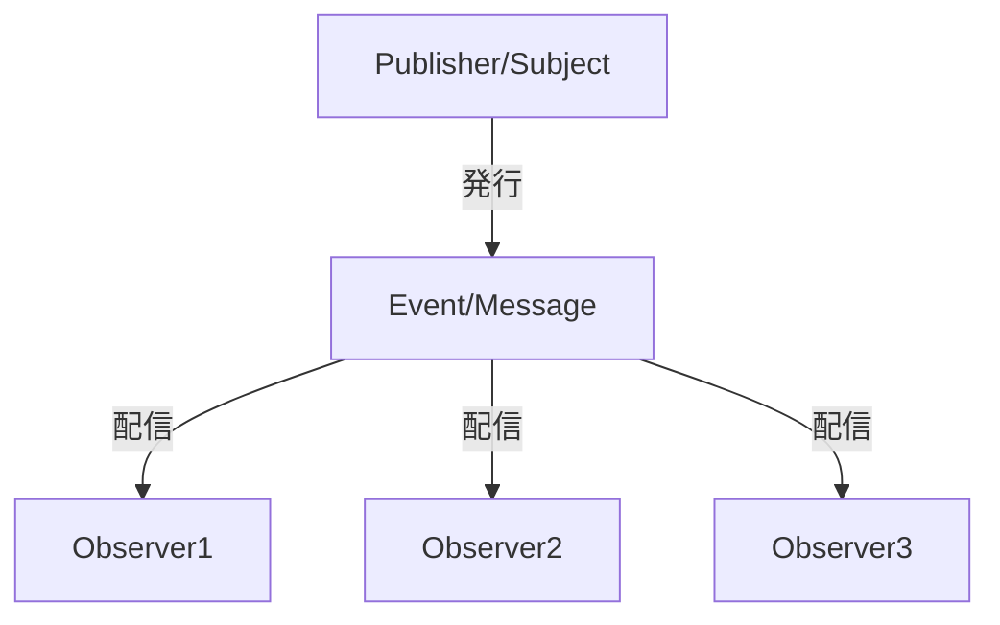
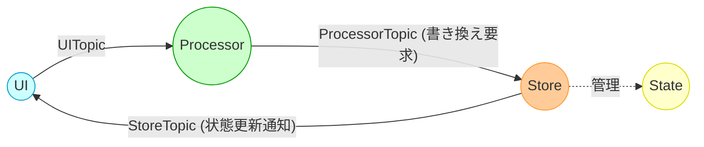

# Observerパターンと PyPubSub によるグローバル状態管理

## 1. Observerパターンとは？

Observerパターンは、「発行者（Subject／Publisher）」と「購読者（Observer／Listener）」の関係を定義するデザインパターンです。  
発行者は状態の変更やイベントを発行し、購読者はそのイベントを受け取り対応する処理を実行します。  
このパターンの主なメリットは、各コンポーネント間の依存関係を低減（疎結合）し、システムの保守性や拡張性を向上させる点にあります。

以下は、Observerパターンの基本概念を Mermaid で表した例です。



## 2. PyPubSub の紹介（基本的な使い方）

PyPubSub は、Observerパターンをシンプルに実現するための Python ライブラリです。  
これにより、各モジュールが直接依存せず、トピックを介してメッセージの送受信が可能になります。

### 2.1 インストールとインポート

```bash
pip install PyPubSub
```

```python
from pubsub import pub
```

### 2.2 リスナー（購読側）の定義と登録

```python
def listener_example(arg1, arg2=None):
    print("listener_example received:")
    print("  arg1 =", arg1)
    print("  arg2 =", arg2)

pub.subscribe(listener_example, "rootTopic")
```

### 2.3 メッセージの送信

```python
pub.sendMessage("rootTopic", arg1=123, arg2={"a": 456, "b": "abc"})
```

上記のコードを実行すると、`listener_example` が呼ばれて引数が出力されます。

## 3. なぜ Observer パターン／PyPubSub が良いのか

- **疎結合な設計**  
  各コンポーネントは直接相手を参照せず、トピックを介してメッセージ送受信するため、変更の影響が局所化されます。

- **拡張性**  
  新たな機能追加時に、既存コードを大きく変更せずに新しい Observer を登録できるため、容易に拡張可能です。

- **テストの容易さ**  
  モジュール間が独立しているため、単体テストやモックを用いたテストがしやすくなります。

- **再利用性**  
  発行側と購読側が分離されるため、同じ仕組みを他のプロジェクトで再利用しやすくなります。

## 4. グローバル状態管理の設計例

### 4.1 UI・Processor・Store・State の関係

グローバルに扱うデータ（状態）は **Store** が一元管理し、  
- **UI** は直接 Store に触らず、  
- ユーザー操作は **Processor** が受け取り、必要に応じて Store を更新、  
- 更新結果は Store から UI に通知される、  
というフローを構成することで、疎結合なアプリケーションを実現できます。

以下はその概念を示す Mermaid 図です。



### 4.2 基底クラスの実装（購読解除の自動化）

ここでは、コンポーネントやページで共通の処理として「購読解除」を自動実行できるように、  
ウィジェットの `destroy()` をオーバーライドしています。  
また、BaseComponent と BasePage で実装がほぼ同じ場合は、下記のように統合し使用できます。

```python
import abc
from tkinter import ttk
from pubsub import pub

class BaseComponent(ttk.Frame, metaclass=abc.ABCMeta):
    """
    再利用可能なコンポーネント／ページの基底クラス

    - 親ウィジェット破棄時に自動的に destroy() が呼ばれる。
    - destroy() をオーバーライドし、購読解除（unsubscribe_all）を実施。
    - これにより、明示的な destroy_component 呼び出しが不要。
    """
    def __init__(self, master=None, **kwargs):
        super().__init__(master, **kwargs)
        self._subscriptions = []  # subscribe 時の登録情報を保持
        self.initialize()
        self.register_pubsub()

    @abc.abstractmethod
    def initialize(self):
        """UI 初期化処理"""
        pass

    @abc.abstractmethod
    def register_pubsub(self):
        """購読処理"""
        pass

    def subscribe(self, listener, topic):
        """
        購読登録と内部リストへの登録を行うラッパーメソッド。
        コンポーネントでの subscribe 時はこのメソッドを利用する。
        """
        pub.subscribe(listener, topic)
        self._subscriptions.append((listener, topic))

    def unsubscribe_all(self):
        """登録済みのすべての購読を解除"""
        for listener, topic in self._subscriptions:
            pub.unsubscribe(listener, topic)
        self._subscriptions.clear()

    def destroy(self):
        """
        ウィジェット破棄前に自動で unsubscribe_all を実行し、
        メモリリークや不必要なイベント受信を防ぐ。
        """
        self.unsubscribe_all()
        super().destroy()
```

### 4.3 Topic／State／Store のクラス実装例

#### 4.3.1 Topic クラス

以下のように、発行主体ごとのトピックを Python 3.11 以降の `StrEnum` で定義する例です。

```python
from enum import StrEnum

class UITopic(StrEnum):
    """UI が発行するトピック"""
    BUTTON_CLICK = "ui.button_click"

class ProcessorTopic(StrEnum):
    """Processor が発行するトピック"""
    REQUEST_COUNTER_INCREMENT = "processor.request_counter_increment"

class StoreTopic(StrEnum):
    """Store が発行するトピック"""
    COUNTER_UPDATED = "store.counter_updated"
```

#### 4.3.2 State クラス

グローバルに管理したい状態を定義します。

```python
from dataclasses import dataclass

@dataclass
class AppState:
    """アプリがグローバルに保持する状態"""
    counter: int = 0
    user_name: str = ""
```

#### 4.3.3 Store クラス (Singleton)

Store はアプリ全体の状態を一元管理し、Processor からの要求に応じて State を更新後、UI に通知します。

```python
from pubsub import pub

class Store:
    _instance = None

    def __new__(cls):
        if cls._instance is None:
            cls._instance = super().__new__(cls)
            cls._instance.state = AppState()
        return cls._instance

    def __init__(self):
        if not hasattr(self, "_initialized"):
            self._initialized = True
            # Processor のカウンター増加要求を購読
            pub.subscribe(self.on_request_counter_increment,
                          ProcessorTopic.REQUEST_COUNTER_INCREMENT.value)

    def on_request_counter_increment(self):
        """Processor のカウンター増加要求を受けた場合の処理"""
        self.state.counter += 1
        # 更新後に UI へ通知
        pub.sendMessage(StoreTopic.COUNTER_UPDATED.value, new_value=self.state.counter)
```

### 4.4 利用例のコードスニペット

以下は、上記の基底クラスやトピック／ストアを利用し、**UI → Processor → Store → UI** の流れを実現する簡易アプリの例です。

```python
import tkinter as tk
from tkinter import ttk
from pubsub import pub
from ttkthemes import ThemedTk

# --- 1. Processor ---
class MyProcessor:
    """
    UI のアクション（UITopic）を購読し、
    必要に応じて ProcessorTopic を発行して Store に要求する。
    """
    def __init__(self):
        pub.subscribe(self.on_button_click, UITopic.BUTTON_CLICK.value)

    def on_button_click(self):
        """UI からのボタンクリックを受けたら、カウンター増加要求を発行"""
        pub.sendMessage(ProcessorTopic.REQUEST_COUNTER_INCREMENT.value)

# --- 2. UIコンポーネント ---
class IncrementButtonComponent(BaseComponent):
    """
    ボタンコンポーネント：クリック時に UITopic.BUTTON_CLICK を発行
    """
    def initialize(self):
        self.button = ttk.Button(self, text="Increment Counter", command=self.on_button_click)
        self.button.pack(pady=5, padx=10)

    def register_pubsub(self):
        # 特に購読はしない
        pass

    def on_button_click(self):
        pub.sendMessage(UITopic.BUTTON_CLICK.value)

class CounterLabelComponent(BaseComponent):
    """
    ラベルコンポーネント：StoreTopic.COUNTER_UPDATED を購読し、表示を更新
    """
    def initialize(self):
        self.label = ttk.Label(self, text="Counter: 0")
        self.label.pack(pady=5, padx=10)

    def register_pubsub(self):
        # 内部の subscribe() メソッドで購読（自動的に一括管理される）
        self.subscribe(self.on_counter_updated, StoreTopic.COUNTER_UPDATED.value)

    def on_counter_updated(self, new_value):
        self.label.config(text=f"Counter: {new_value}")

# --- 3. ページ ---
class MainPage(BaseComponent):
    """
    ページ全体：上記コンポーネントを配置
    ※ BaseComponent を継承しているので、destroy() 時に子コンポーネントも自動的に購読解除される。
    """
    def initialize(self):
        self.button_component = IncrementButtonComponent(self)
        self.button_component.pack()

        self.label_component = CounterLabelComponent(self)
        self.label_component.pack()

    def register_pubsub(self):
        # ページ自身が購読するトピックがあればここに書く
        pass

# --- 4. ルートウィンドウ ---
import abc

class BaseRoot(ThemedTk, metaclass=abc.ABCMeta):
    """
    アプリケーションのルートウィンドウの基底クラス
    """
    def __init__(self, **kwargs):
        super().__init__(**kwargs)
        self.set_theme("arc")
        self.initialize()
        self.register_pubsub()

    @abc.abstractmethod
    def initialize(self):
        pass

    @abc.abstractmethod
    def register_pubsub(self):
        pass

    @abc.abstractmethod
    def destroy_root(self):
        pass

class MyApp(BaseRoot):
    def initialize(self):
        self.title("Observer & PyPubSub Demo")
        self.geometry("300x200")

        # メインページを配置（BaseComponent継承）
        self.page = MainPage(self)
        self.page.pack(expand=True, fill="both")

        # Store（シングルトン）と Processor を生成
        self.store = Store()
        self.processor = MyProcessor()

    def register_pubsub(self):
        pass

    def destroy_root(self):
        # 必要であればウィンドウ破棄時の処理を記述
        self.page.destroy()  # 子ウィジェット（購読含む）も自動破棄
        self.destroy()

if __name__ == "__main__":
    app = MyApp()
    app.mainloop()
```

### 4.5 まとめ

- **UI はトピックを介して操作を発行** し、グローバル状態（Store）には直接触れない  
- **Processor は UI からの操作を受け取り、Store に対して状態変更をリクエスト**  
- **Store はシングルトンとしてグローバル状態を一元管理** し、更新時にトピックを発行して UI に通知  
- **UI コンポーネントは更新通知を購読し、画面表示を更新**  
- **購読は共通基底クラスにラップし、destroy() オーバーライドで自動的に購読解除** することで、明示的な unsubscribe の記述を最小限に抑える  

これらを組み合わせることで、疎結合・拡張性の高いアプリケーションが構築でき、保守性の向上にも寄与します。