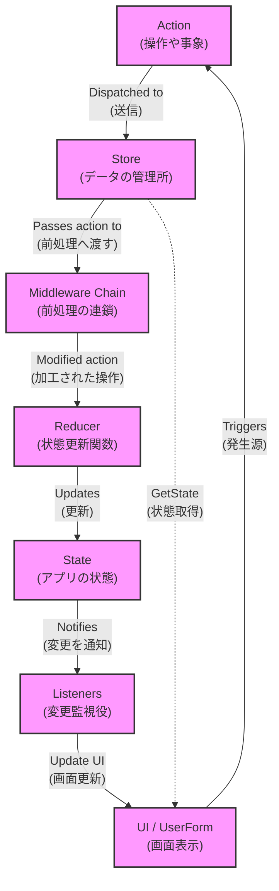

# Redux on VBA

## サンプルコード

```vba
' アクションタイプモジュール (ActionTypes.bas)
Public Enum ActionType
    INCREMENT = 0
    DECREMENT = 1
    RESET = 2
    ADD = 3
    NOOP = 4
    ASYNC_INCREMENT_START = 5
    ASYNC_INCREMENT_COMPLETE = 6
    THUNK = 7
End Enum

' アクションモジュール (Actions.bas)
Public Type Action
    Type As ActionType
    Payload As Variant
End Type

' アクションクリエイターモジュール (ActionCreators.bas)
Public Function IncrementAction() As Action
    IncrementAction.Type = ActionType.INCREMENT
End Function

Public Function DecrementAction() As Action
    DecrementAction.Type = ActionType.DECREMENT
End Function

Public Function ResetAction() As Action
    ResetAction.Type = ActionType.RESET
End Function

Public Function AddAction(ByVal Value As Long) As Action
    AddAction.Type = ActionType.ADD
    AddAction.Payload = Value
End Function

Public Function AsyncIncrementAction() As Action
    AsyncIncrementAction.Type = ActionType.ASYNC_INCREMENT_START
End Function

Public Function AsyncIncrementCompleteAction() As Action
    AsyncIncrementCompleteAction.Type = ActionType.ASYNC_INCREMENT_COMPLETE
End Function

Public Function ThunkAction(ByVal ThunkProc As String) As Action
    ThunkAction.Type = ActionType.THUNK
    ThunkAction.Payload = ThunkProc
End Function

' ミドルウェアモジュール (Middleware.bas)
Public Function LoggingMiddleware(ByVal Action As Action) As Action
    Debug.Print "Action dispatched: " & Action.Type & ", Payload: " & CStr(Action.Payload)
    LoggingMiddleware = Action
End Function

Public Function ValidationMiddleware(ByVal Action As Action) As Action
    Dim ValidatedAction As Action
    ValidatedAction = Action
    
    Select Case Action.Type
        Case ActionType.ADD
            If IsNumeric(Action.Payload) Then
                If Action.Payload < -100 Or Action.Payload > 100 Then
                    Debug.Print "Warning: ADD action payload out of range (-100 to 100). Clamping value."
                    ValidatedAction.Payload = Application.WorksheetFunction.Min(Application.WorksheetFunction.Max(Action.Payload, -100), 100)
                End If
            Else
                Debug.Print "Error: ADD action payload is not numeric. Ignoring action."
                ValidatedAction.Type = ActionType.NOOP
            End If
    End Select
    
    ValidationMiddleware = ValidatedAction
End Function

Public Function AsyncMiddleware(ByVal Action As Action) As Action
    If Action.Type = ActionType.ASYNC_INCREMENT_START Then
        Application.OnTime Now + TimeValue("00:00:03"), "CompleteAsyncIncrement"
        Debug.Print "AsyncMiddleware: Started async increment"
    End If
    AsyncMiddleware = Action
End Function

Public Function ThunkMiddleware(ByVal Action As Action) As Action
    If Action.Type = ActionType.THUNK Then
        Application.Run CStr(Action.Payload)
        ThunkMiddleware.Type = ActionType.NOOP
    Else
        ThunkMiddleware = Action
    End If
End Function

' 非同期処理完了時に呼び出される関数
Public Sub CompleteAsyncIncrement()
    Dispatch AsyncIncrementCompleteAction()
End Sub

' 複雑な処理の例（Thunkとして使用）
Public Sub ComplexOperation()
    Dispatch ResetAction()
    Dispatch AddAction(10)
    Dispatch IncrementAction()
    
    If GetState().Count > 5 Then
        Dispatch AddAction(5)
    Else
        Dispatch DecrementAction()
    End If
    
    Dispatch AsyncIncrementAction()
End Sub

' 標準モジュールの処理をThunkとして実行する例
Public Sub ModuleListenerThunk()
    Debug.Print "ModuleListenerThunk: Count is now " & GetState().Count
End Sub

' ストアモジュール (Store.bas)
Public Type State
    Count As Integer
    IsLoading As Boolean
End Type

Private CurrentState As State
Private Middlewares As Collection
Private Listeners As Collection

Public Function GetState() As State
    GetState = CurrentState
End Function

Public Sub AddMiddleware(ByVal Middleware As String)
    If Middlewares Is Nothing Then
        Set Middlewares = New Collection
    End If
    Middlewares.Add Middleware
End Sub

Public Sub AddListener(ByVal Listener As Object)
    If Listeners Is Nothing Then
        Set Listeners = New Collection
    End If
    Listeners.Add Listener
End Sub

Public Sub Dispatch(ByVal Action As Action)
    Dim FinalAction As Action
    FinalAction = ApplyMiddlewares(Action)
    
    CurrentState = Reducer(CurrentState, FinalAction)
    
    NotifyListeners
End Sub

Private Function ApplyMiddlewares(ByVal Action As Action) As Action
    Dim Middleware As Variant
    Dim Result As Action
    Result = Action
    
    If Not Middlewares Is Nothing Then
        For Each Middleware In Middlewares
            Result = Application.Run(Middleware, Result)
        Next Middleware
    End If
    
    ApplyMiddlewares = Result
End Function

Private Sub NotifyListeners()
    Dim Listener As Variant
    
    If Not Listeners Is Nothing Then
        For Each Listener In Listeners
            Listener.OnStateChange CurrentState
        Next Listener
    End If
    
    ' 標準モジュールの処理をThunkとして実行
    Dispatch ThunkAction("ModuleListenerThunk")
End Sub

Public Function Reducer(ByVal State As State, ByVal Action As Action) As State
    Dim NewState As State
    NewState = State
    
    Select Case Action.Type
        Case ActionType.INCREMENT
            NewState.Count = State.Count + 1
        Case ActionType.DECREMENT
            NewState.Count = State.Count - 1
        Case ActionType.RESET
            NewState.Count = 0
        Case ActionType.ADD
            If Not IsEmpty(Action.Payload) Then
                NewState.Count = State.Count + CLng(Action.Payload)
            End If
        Case ActionType.ASYNC_INCREMENT_START
            NewState.IsLoading = True
        Case ActionType.ASYNC_INCREMENT_COMPLETE
            NewState.Count = State.Count + 1
            NewState.IsLoading = False
    End Select
    
    Reducer = NewState
End Function

' クラスモジュール (ClassListener.cls)
Option Explicit

Public Sub OnStateChange(ByVal NewState As State)
    Debug.Print "ClassListener: Count is now " & NewState.Count
End Sub

' ユーザーフォーム (CounterForm.frm)
Option Explicit

Private Sub UserForm_Initialize()
    AddListener Me
    UpdateUI
End Sub

Private Sub IncrementButton_Click()
    Dispatch IncrementAction()
End Sub

Private Sub DecrementButton_Click()
    Dispatch DecrementAction()
End Sub

Private Sub ResetButton_Click()
    Dispatch ResetAction()
End Sub

Private Sub AddButton_Click()
    Dispatch AddAction(10)
End Sub

Private Sub AsyncIncrementButton_Click()
    Dispatch AsyncIncrementAction()
End Sub

Private Sub ComplexOperationButton_Click()
    Dispatch ThunkAction("ComplexOperation")
End Sub

Public Sub OnStateChange(ByVal NewState As State)
    UpdateUI
End Sub

Private Sub UpdateUI()
    CountLabel.Caption = "Count: " & GetState().Count
    If GetState().IsLoading Then
        StatusLabel.Caption = "Loading..."
    Else
        StatusLabel.Caption = "Ready"
    End If
End Sub

' メインモジュール (Main.bas)
Sub Main()
    ' ミドルウェアを追加
    AddMiddleware "LoggingMiddleware"
    AddMiddleware "ValidationMiddleware"
    AddMiddleware "AsyncMiddleware"
    AddMiddleware "ThunkMiddleware"
    
    ' リスナーを追加
    Dim ClassListener As New ClassListener
    AddListener ClassListener
    
    ' 初期状態を設定
    Dispatch ResetAction()
    
    ' フォームを表示
    CounterForm.Show
End Sub
```

## Reduxという概念

### 登場人物

1. Action (操作や事象): ユーザーの操作やシステムイベントなど、アプリケーション内で発生する出来事を表します。

2. Store (データの管理所): アプリケーション全体のデータ（State）を一元管理し、データの変更を制御します。

3. Middleware Chain (前処理の連鎖): Actionが状態更新関数に渡される前に、ログ記録や非同期処理などの追加処理を行う仕組みです。

4. Reducer (状態更新関数): 現在の状態とActionを基に、新しい状態を生成する純粋な関数です。直接状態を変更せず、新しい状態オブジェクトを返します。

5. State (アプリの状態): アプリケーション全体の現在の状態を表すデータ構造です。

6. Listeners (変更監視役): 状態の変更を監視し、変更があった場合に通知を受け取るオブジェクトです。

7. UI / UserForm (画面表示): ユーザーに情報を表示し、操作を受け付けるインターフェースです。状態の変更に応じて自動的に更新されます。

### Reduxの処理フロー



### メリット

1. データの流れが一方向：
   - データは常に決まった方向に流れるため、アプリケーションの動作が予測しやすくなります。

2. 中央集中型のデータ管理：
   - Storeがアプリケーション全体のデータを一箇所で管理するため、データの把握と制御が容易になります。

3. 決まったプロセスでのデータ更新：
   - データの更新は必ずActionを介して行われるため、変更の追跡と管理が容易になります。

4. 柔軟な機能拡張：
   - Middleware Chainを使うことで、ログ記録や非同期処理などの機能を簡単に追加できます。

5. テストしやすい設計：
   - Reducerは入力に対して常に同じ出力を返す関数なので、動作のテストが容易です。

6. 自動的な画面更新：
   - 状態が変更されると自動的に画面が更新されるため、データと表示の一貫性が保たれます。

## コードのBeforeAfter

まず、「Before」のコード例を示し、次に「After」のReduxを使用したコード例を示します。

```vba
' UserForm1
Option Explicit

Private Sub UserForm_Initialize()
    txtCounter.Value = 0
    UpdateButtonStates
End Sub

Private Sub btnIncrement_Click()
    txtCounter.Value = txtCounter.Value + 1
    UpdateButtonStates
End Sub

Private Sub btnDecrement_Click()
    txtCounter.Value = txtCounter.Value - 1
    UpdateButtonStates
End Sub

Private Sub btnReset_Click()
    txtCounter.Value = 0
    UpdateButtonStates
End Sub

Private Sub UpdateButtonStates()
    btnDecrement.Enabled = (txtCounter.Value > 0)
End Sub

' Module1
Public Sub PerformComplexOperation()
    ' 複雑な処理
    UserForm1.txtCounter.Value = UserForm1.txtCounter.Value + 10
    UserForm1.UpdateButtonStates
End Sub

' Module2
Public Sub LogCounterValue()
    Debug.Print "現在のカウンター値: " & UserForm1.txtCounter.Value
End Sub

```

このBefore例では、以下のような問題があります：

1. 状態（カウンター値）がUIに直接結びついている
2. ビジネスロジックとUIロジックが混在している
3. 他のモジュールから直接UIの値を変更している
4. 状態の変更を追跡するのが困難

次に、Reduxパターンを使用した「After」のコード例を示します。

```vba
' Store Module
Option Explicit

Private Type State
    Count As Long
End Type

Private CurrentState As State
Private Listeners As Collection

Public Sub InitializeStore()
    Set Listeners = New Collection
    CurrentState.Count = 0
End Sub

Public Function GetState() As State
    GetState = CurrentState
End Function

Public Sub Dispatch(ByVal Action As String, Optional ByVal Payload As Variant)
    Select Case Action
        Case "INCREMENT"
            CurrentState.Count = CurrentState.Count + 1
        Case "DECREMENT"
            If CurrentState.Count > 0 Then
                CurrentState.Count = CurrentState.Count - 1
            End If
        Case "RESET"
            CurrentState.Count = 0
        Case "ADD"
            CurrentState.Count = CurrentState.Count + Payload
    End Select
    NotifyListeners
End Sub

Public Sub AddListener(ByVal Listener As Object)
    Listeners.Add Listener
End Sub

Private Sub NotifyListeners()
    Dim Listener As Variant
    For Each Listener In Listeners
        Listener.OnStateChange CurrentState
    Next Listener
End Sub

' UserForm1
Option Explicit

Private Sub UserForm_Initialize()
    Store.AddListener Me
    UpdateUI
End Sub

Private Sub btnIncrement_Click()
    Store.Dispatch "INCREMENT"
End Sub

Private Sub btnDecrement_Click()
    Store.Dispatch "DECREMENT"
End Sub

Private Sub btnReset_Click()
    Store.Dispatch "RESET"
End Sub

Public Sub OnStateChange(ByVal NewState As State)
    UpdateUI
End Sub

Private Sub UpdateUI()
    Dim CurrentState As State
    CurrentState = Store.GetState
    
    txtCounter.Value = CurrentState.Count
    btnDecrement.Enabled = (CurrentState.Count > 0)
End Sub

' Module1
Public Sub PerformComplexOperation()
    ' 複雑な処理
    Store.Dispatch "ADD", 10
End Sub

' Module2
Public Sub LogCounterValue()
    Dim CurrentState As State
    CurrentState = Store.GetState
    Debug.Print "現在のカウンター値: " & CurrentState.Count
End Sub

' ThisWorkbook
Private Sub Workbook_Open()
    Store.InitializeStore
End Sub

```

この After 例では、Reduxパターンを使用して以下の改善が行われています：

1. 状態管理が一元化され、Store モジュールで管理されている
2. UIロジックとビジネスロジックが分離されている
3. 状態の変更は必ず Dispatch を通じて行われ、追跡が容易になっている
4. UIの更新が自動化され、状態と表示の一貫性が保たれている
5. 他のモジュールからも一貫した方法で状態にアクセスできる

Reduxパターンを使用することで、コードの構造が改善され、以下のような利点があります：

1. 保守性の向上：状態管理が一元化されているため、バグの追跡や機能の追加が容易になります。
2. テスト容易性：ビジネスロジックがUIから分離されているため、単体テストが書きやすくなります。
3. 拡張性：新しい機能や状態を追加する際の影響範囲が限定的になります。
4. デバッグの容易さ：すべての状態変更が追跡可能なため、問題の特定が容易になります。
5. 一貫性：アプリケーション全体で一貫した状態管理の方法を使用できます。

このBefore/After比較により、VBA開発者はReduxパターンの利点をより具体的に理解できるでしょう。大規模なアプリケーションや複雑な状態管理が必要な場合に、特にその効果を発揮します。
